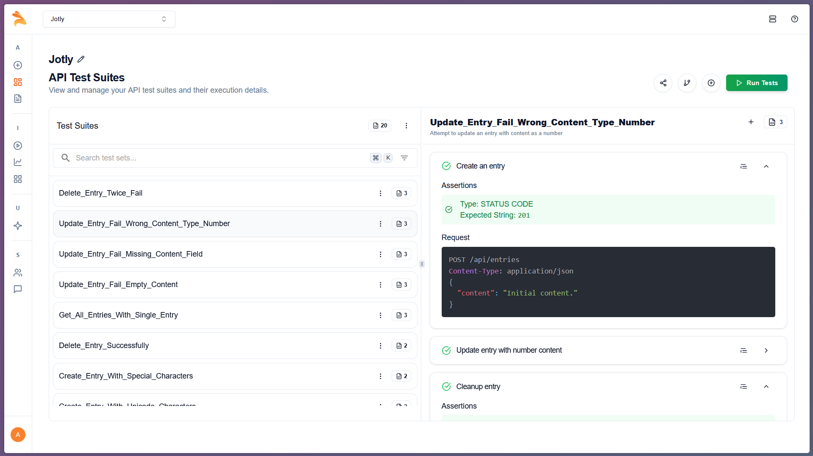
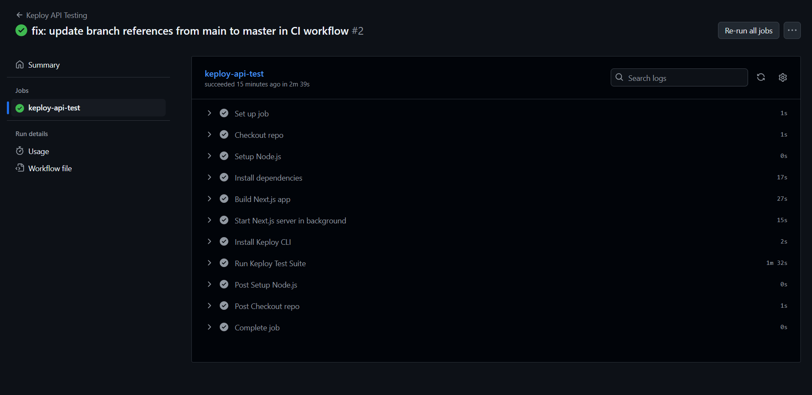

# AI Mood Journal 📝

Ever wanted to track your mood but also get some AI insights on what you're feeling? Yeah, me too. That's why I built this journal app that not only saves your thoughts but also analyzes them using AI to give you sentiment analysis and extract keywords. Pretty neat, right?

## What does this thing do?

- Write journal entries (obviously)
- AI automatically figures out if you're happy, sad, or whatever
- Extracts important keywords from your writing
- Shows you cool charts of your mood over time
- Full CRUD functionality (Create, Read, Update, Delete)

## Tech Stack (The usual suspects)

- **Next.js 14** with App Router
- **TypeScript** (type safety is life)
- **Neon PostgreSQL** (serverless DB that doesn't break the bank)
- **Hugging Face API** (for the AI magic)
- **Jest** (for testing, obviously)
- **Keploy** (AI-powered API testing because manual testing is for chumps)
- **Vercel** (deploy and forget)

## Getting Started (Don't worry, it's easy)

### 1. Clone this bad boy

```bash
git clone https://github.com/aarabii/Ai-mood-journal-api.git
cd Ai-mood-journal-api
```

### 2. Install the dependencies

```bash
npm install
```

### 3. Environment variables (the secret sauce)

Create a `.env.local` or `.env` file and add these:

```env
# Get this from Neon dashboard or vercel storage
DATABASE_URL="your_neon_database_url_here"

# Get this from Hugging Face with read access
HF_TOKEN="your_hugging_face_token"
```

**Pro tip**: Don't commit this file. It's already in `.gitignore` but just saying.

### 4. Fire it up

```bash
npm run dev
```

### 5. Setup the database (one-time thing)

Hit this URL once to create the table: `http://localhost:3000/api/setup`

Then you're good to go at `http://localhost:3000`

## API Endpoints & Testing (All tested, all working)

### Quick API Reference

| Method   | Endpoint                 | What it does                                        | Test Status |
| -------- | ------------------------ | --------------------------------------------------- | ----------- |
| `GET`    | `/api/entries`           | Get all your journal entries                        | ✅ Tested   |
| `POST`   | `/api/entries`           | Create new entry + AI analysis                      | ✅ Tested   |
| `PUT`    | `/api/entries/[id]`      | Update an entry                                     | ✅ Tested   |
| `DELETE` | `/api/entries/[id]`      | Delete an entry                                     | ✅ Tested   |
| `GET`    | `/api/stats`             | Get mood stats and charts data                      | ✅ Tested   |
| `GET`    | `/api/keywords/trending` | Most used keywords                                  | ✅ Tested   |
| `GET`    | `/api/setup`             | Initialize DB (dev only testing code not available) | ✅ Tested   |

### Curl Commands (For the command line warriors)

Want to test the API manually? Here are the curl commands you need:

```bash
# 1. GET /api/entries - Get all journal entries
curl -X GET "http://localhost:3000/api/entries"

# 2. POST /api/entries - Create a new entry
curl -X POST "http://localhost:3000/api/entries" \
     -H "Content-Type: application/json" \
     -d '{ "content": "Today was a good day, I finished all my tasks and felt productive." }'

# 3. PUT /api/entries/[id] - Update an entry
curl -X PUT "http://localhost:3000/api/entries/ID_OF_THE_ENTRY_TO_UPDATE" \
     -H "Content-Type: application/json" \
     -d '{ "content": "Updated journal entry content. I also learned something new." }'

# 4. DELETE /api/entries/[id] - Delete an entry
curl -X DELETE "http://localhost:3000/api/entries/ID_OF_THE_ENTRY_TO_DELETE"

# 5. GET /api/stats - Get mood stats and charts data
curl -X GET "http://localhost:3000/api/stats"

# 6. GET /api/keywords/trending - Get most used keywords
curl -X GET "http://localhost:3000/api/keywords/trending"
```

## Testing Strategy (Multiple layers of confidence)

### Traditional Testing with Jest

Look, I know testing isn't the most exciting thing, but I actually went all out on this one. Here's what I built (ps - this was my first time writing tests, so be kind):

#### Test Coverage (I'm kinda proud of this)


**The numbers don't lie:**

- 📊 **72.13% overall coverage**
- 🎯 **95.45% API route coverage** (almost perfect)
- 🗄️ **89.72% database lib coverage**
- ⚡ **19 tests across 3 suites**
- 🕐 **~15 seconds runtime**

#### Running the tests

```bash
# Run all tests
npm test

# Run with coverage report
npm run test:coverage

# Watch mode for development
npm run test:watch
```

#### What I actually tested

**Unit Tests** (`__tests__/unit.test.ts`)

- Core application logic
- Both mocked and real database scenarios (because why not test both ways?)
- Edge cases and error handling

**Integration Tests** (`__tests__/integration.test.ts`)

- Full CRUD operations with real temp database
- Data integrity checks
- Transaction handling

**API Tests** (`__tests__/api.test.ts`)

- Request/response validation
- Error scenarios (400s, 500s, etc.)

#### Testing philosophy

I went with both mocked and non-mocked approaches because:

1. **Mocked tests** = fast, isolated, test the logic
2. **Non-mocked tests** = slow but real, test actual database behavior
3. **Best of both worlds** = confidence that everything actually works

### AI-Powered API Testing with Keploy

But wait, there's more! I also integrated Keploy for AI-powered API testing because manually writing test cases is so 2023. Keploy automatically generates test cases and mocks, helping achieve 90% test coverage in minutes. It's basically having an AI testing assistant that never gets tired or makes typos.

#### Keploy Dashboard Results



The Keploy dashboard shows comprehensive API testing results with automatic test case generation and validation. It caught edge cases I didn't even think of (thanks AI overlords 🤖).

#### CI/CD Integration Success



And yes, it runs perfectly in the CI/CD pipeline too! GitHub Actions picks up the Keploy tests and runs them automatically on every push. No more "it works on my machine" excuses.

**What Keploy tested for us:**

- API response validation
- Edge case scenarios
- Performance regression detection
- Mock generation for external dependencies
- Automatic test case creation from real traffic

## CI/CD Pipeline (Automated like a boss)

The project includes a complete CI/CD setup with GitHub Actions that:

1. **Runs Jest tests** (unit, integration, API)
2. **Executes Keploy AI tests** (automated API testing)
3. **Validates all endpoints** (no broken APIs allowed)
4. **Generates coverage reports** (accountability is key)
5. **Deploys to Vercel** (if everything passes)

Check out the `.github/workflows/` directory for the full configuration. It's pretty solid and catches issues before they reach production.

## Project Structure (Organized chaos)

```
src/
├── app/
│   ├── api/                    # All the API magic happens here
│   │   ├── entries/
│   │   │   ├── [id]/route.ts  # Update/Delete specific entry
│   │   │   └── route.ts       # Get all/Create new entry
│   │   ├── keywords/
│   │   │   └── trending/route.ts
│   │   ├── setup/route.ts     # DB setup
│   │   └── stats/route.ts     # Analytics endpoint
│   ├── (main)/page.tsx        # The main UI
│   ├── globals.css
│   └── layout.tsx
├── components/                 # Reusable UI stuff
├── lib/                       # Database & utility functions
├── constant/                  # Config and constants
├── __tests__/                 # Test files
│   ├── unit.test.ts
│   ├── api.test.ts
│   └── integration.test.ts
└── .github/workflows/         # CI/CD configuration
```

## Deployment (One click wonder)

This thing is built for Vercel:

1. Push to GitHub (or whatever git provider)
2. Connect to Vercel
3. Add your `DATABASE_URL` and `HF_TOKEN` in environment variables
4. Hit deploy
5. Grab a coffee ☕

The CI/CD pipeline handles testing automatically, so you'll know if something's broken before it goes live.

## The AI Integration (The cool part)

Using Hugging Face's inference API for:

- **Sentiment Analysis**: Determines if your entry is positive, negative, or neutral
- **Named Entity Recognition**: Extracts important keywords and entities
- **Real-time processing**: Happens automatically when you save an entry

Plus Keploy's AI testing for:

- **Automatic test generation**: Creates comprehensive test suites
- **Smart mocking**: Generates realistic mocks for external services
- **Regression detection**: Catches performance and functionality issues

## Development Notes (For future me)

- Database migrations are handled by the `/api/setup` endpoint (lazy but works)
- AI API calls are cached in the database (save those API calls)
- Error handling is comprehensive (learned from production crashes 😅)
- TypeScript everywhere because runtime errors are not fun
- Keploy integration saves hours of manual test writing
- CI/CD pipeline prevents most stupid mistakes from reaching production

## What I learned building this

1. Testing is actually satisfying when you get good coverage
2. Hugging Face API is surprisingly easy to use
3. Neon's serverless PostgreSQL is perfect for side projects
4. Next.js App Router is growing on me
5. Good error handling saves you debugging time later
6. AI-powered testing is a game changer (seriously, try Keploy)
7. Proper CI/CD setup pays for itself in prevented bugs
8. Don't underestimate the power of good documentation
9. Always test your curl commands before sharing them

## Contributing

If you want to contribute:

1. Fork it
2. Make your changes
3. **Write tests** (seriously, I'll reject PRs without tests)
4. Make sure all tests pass (both Jest and Keploy)
5. Ensure CI/CD pipeline passes
6. Submit a PR

## License

MIT - do whatever you want with it.

---

Built with ❤️ and probably too much coffee ☕

_P.S. - If you find bugs, please open an issue. Or better yet, fix it and send a PR! The CI/CD pipeline will catch any issues before they merge. 🚀_
